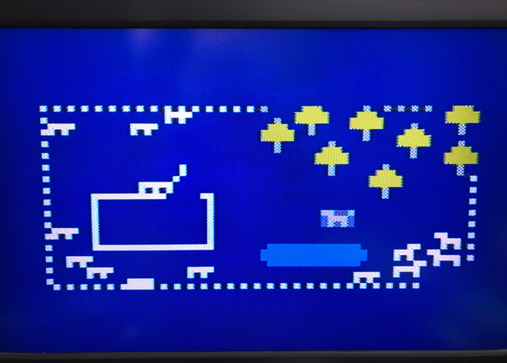
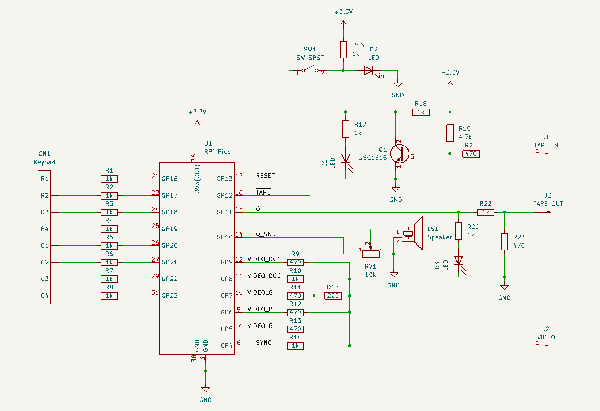

# VIP/Pico with Color

Raspberry Pi Pico を用いた、COSMAC VIP のエミュレータ。
以前から公開していた [VIP/Pico](https://github.com/AutomaticComputer/VIPonPico)に
VP-590 Color Board 相当の機能を加え、
カラーの NTSC ビデオ信号を出力するようにしました(「大体 NTSC」と言うべきかも)。
追加部品は(ビデオ周りでは)抵抗のみです。

現代において NTSC で出力する意味はあまり無いかもしれませんが、昔のマイコンな感じが出ているかと思います。
だからといって、RF モジュレータを通すことまでは考えていませんが。
(世の中には、モノクロですが[電波までマイコンで生成している](https://hackaday.com/2015/02/26/attiny85-does-over-the-air-ntsc/)
人もいますね…)

導入法、操作法等についてはこちらを。

[VIP/Pico](https://github.com/AutomaticComputer/VIPonPico)

[COSMAC VIP 上のソフトウェア](doc/software.md)

## 言い訳

カラー版も、いろいろ怪しいところがあります。
特に、ハードウェア部分に関しては、接続先を壊さないとは限りません。
全体的に、「手元では動いている」というレベルのものです。
(詳しくはVIP/Pico の README.md をご覧ください。)

## ハードウェア

VIP/Pico に比べると、抵抗が 5 本増えています。

## カラー信号の発生について

Raspberry Pi Pico の PIO(programmable I/O)を 1 つ(state machine を 4 つ)使い、
またCPUのエミュレーションに主に core 0, ビデオ出力に主に core 1 を使っています。

ビデオ信号のうち V-SYNC, H-SYNC については、
[Sagar さんの記事](https://sagargv.blogspot.com/2014/07/ntsc-demystified-color-demo-with.html)
にも書いてある通り、
多少規格から外れていても(安定していれば)あまり問題無く表示されるようですが、
色副搬送波の方はかなり正確に 315/88=3.579545454... MHz
でなければならないようです。
規格では±10 Hz となっていますが、さすがに実際のテレビではそこまで厳密ではないようです。

システムクロックとは別に 3.579545... MHz の水晶振動子を発振させるのが
ちゃんとした方法だと思いますが、可能な限り追加回路を少なくしようということで、
システムクロックを 128 MHz として、
クロックを 17.8793651 分の一に分割して PIO を約 7.16 MHz で動かし、約 3.58 MHz の方形波を作っています。
実際には clkdiv の小数部分は 1 バイトなので、clkdiv=17.87890625 になっており、
副搬送波は 3.579637 MHz ほどで、100 Hz ほどずれています…が、何とかなっています。
テレビによっては、画像が乱れたりカラーにならなかったりするかもしれません。
クロック分割を半分にして、PIO の 4 クロックを 3.58 MHz とすることも試みましたが、
これだとうまく表示されませんでした。
誤差が大きすぎるか、小数部分による揺らぎが大きすぎるためだと思われます。

3 つの state machine を、少し時間を空けて開始する(clkdiv カウンターをリスタートする)ことにより
3 つの相の方形波を作っています。
もう一つの state machine を使って、これらのカラー信号と
もう 2 つの DC 信号(輝度)を on/off し、これらの出力を抵抗で組み合わせたものが
最終的な信号となっています。

色ずれがそこそこありますが、方形波ではこのへんが限界なのか、
あるいはもう少し工夫の余地があるのか…
また、色が少し波打つ感じがあるのは、
色副搬送波の周波数が正確でないためだと推測しています。

システムクロックを78.75 MHz にすれば正確に 3.5795... MHz が作れますが、これだと縞模様が出てしまいます。
([このあたりにある理由](https://sagargv.blogspot.com/2011/04/ntsc-demystified-nuances-and-numbers.html)
によるものと思われます。)
システムクロックの取り方によっては、色はきれいに出るが画像が不安定、という感じになります。
安定して表示されるのは 128 MHz でした。
(テレビによるかもしれませんが。)

## 謝辞

カラーの NTSC ビデオ信号については、以下のようなページを参考にしました。

ChaN さんの[RS-170A NTSCビデオ信号タイミング規格の概要](http://elm-chan.org/docs/rs170a/spec_j.html)

nekosan さんの [ＣＰＬＤでコンポジットビデオ　”ネコ８”](http://picavr.uunyan.com/vhdl_composite.html)

ケンケンさんの [PICマイコンによるカラーコンポジットビデオ出力実験](http://www.ze.em-net.ne.jp/~kenken/composite/index.html)

Sagar さんの [All Digital NTSC Color](https://www.sagargv.com/proj/ntsc/), 
[https://sagargv.blogspot.com/2014/07/ntsc-demystified-color-demo-with.html](https://sagargv.blogspot.com/2014/07/ntsc-demystified-color-demo-with.html)
