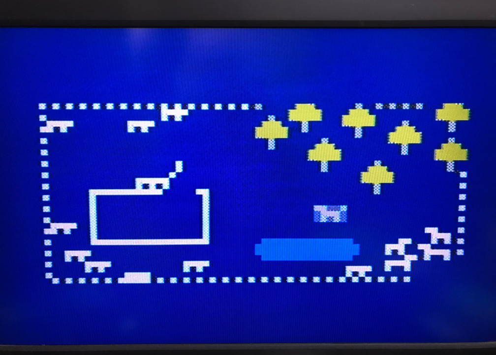

# VIP/Pico with Color

An emulator of COSMAC VIP on Raspberry Pi Pico. 
To [VIP/Pico](https://github.com/AutomaticComputer/VIPonPico), which I developed earlier, 
I added the functionality of VP-590 Color Board, 
so that it outputs NTSC(-ish) color signal. 
The only additional parts (concerning the video) are resistors. 

Maybe it is not of much use to output NTSC, 
but it feels like an early microcomputer. 

There are 2 executable files to choose from(see "Generating the color signal"): 

- [128MHz version](build/pico_vip.uf2). 
This gives a relatively natural image(the photo above), though there will be some color bleeding. 
The background feels somewhat unstable. 
Some TVs may fail to recognize the color signal. 
- [78.75MHz version](build/pico_vip_78750.uf2). 
This gives a sharper image, but also some stripes and ghost(?) (the photo below). 
I think this is closer to the real VIP + VP-590. 

See the page on the BW version for how to use it. 

[VIP/Pico](https://github.com/AutomaticComputer/VIPonPico)

[Software on COSMAC VIP](doc/software.md)

## Disclaimers

As with the BW version, this is not a stable release. 
It might break the peripherals. 
(See README.md of VIP/Pico for details.)

## Hardware

You need five more resistors than with VIP/Pico. 

## Generating the color signal

Four state machines of one PIO(programmable I/O) is used. 
Core 0 is mainly used for the emulation of the CPU, 
core 1 for video output. 

Not yet translated...

ビデオ信号のうち V-SYNC, H-SYNC については、
[Sagar さんの記事](https://sagargv.blogspot.com/2014/07/ntsc-demystified-color-demo-with.html)
にも書いてある通り、
多少規格から外れていても(安定していれば)あまり問題無く表示されるようですが、
色副搬送波の方はかなり正確に 315/88=3.579545454... MHz
でなければならないようです。
規格では±10 Hz となっていますが、さすがに実際のテレビではそこまで厳密ではないようです。

- システムクロック128 MHz版では、
クロックを 17.8793651 分の一に分割して PIO を約 7.16 MHz で動かし、約 3.58 MHz の方形波を作っています。
実際には clkdiv の小数部分は 1 バイトなので、clkdiv=17.87890625 になっており、
副搬送波は 3.579637 MHz ほどで、100 Hz ほどずれています…が、何とかなっています。
テレビによっては、画像が乱れたりカラーにならなかったりするかもしれません。
クロック分割を半分にして、PIO の 4 クロックを 3.58 MHz とすることも試みましたが、
これだとうまく表示されませんでした。
誤差が大きすぎるか、小数部分による揺らぎが大きすぎるためだと思われます。
色ずれがそこそこありますが、方形波のせいなのか、
あるいはもう少し工夫の余地があるのか…
また、色が少し波打つ感じがあるのは、
色副搬送波の周波数が正確でないためだと推測しています。

- 78.75 MHz 版では、22 分周して正確な 3.579545... MHz を作っていますが、縞模様が出てしまいます。
([このあたりにある理由](https://sagargv.blogspot.com/2011/04/ntsc-demystified-nuances-and-numbers.html)
によるものと思われます。)
1802 のクロックはその半分で、実際の VIP + VP-590 と大体同じ構成になっていると思います。
アナログ部分を真似れば改善するのかもしれません。

PIO の 3 つの state machine を、少し時間を空けて開始する(clkdiv カウンターをリスタートする)ことにより
3 つの相の方形波を作っています。
もう一つの state machine を使って、これらのカラー信号と
もう 2 つの DC 信号(輝度)を on/off し、これらの出力を抵抗で組み合わせたものが
最終的な信号となっています。

## Acknowledgements

I referred to the following pages for the color NTSC video signal. 

ChaN さん [RS-170A NTSCビデオ信号タイミング規格の概要](http://elm-chan.org/docs/rs170a/spec_j.html)

nekosan さん [ＣＰＬＤでコンポジットビデオ　”ネコ８”](http://picavr.uunyan.com/vhdl_composite.html)

ケンケンさん [PICマイコンによるカラーコンポジットビデオ出力実験](http://www.ze.em-net.ne.jp/~kenken/composite/index.html)

Sagar さん [All Digital NTSC Color](https://www.sagargv.com/proj/ntsc/), 
[https://sagargv.blogspot.com/2014/07/ntsc-demystified-color-demo-with.html](https://sagargv.blogspot.com/2014/07/ntsc-demystified-color-demo-with.html)
